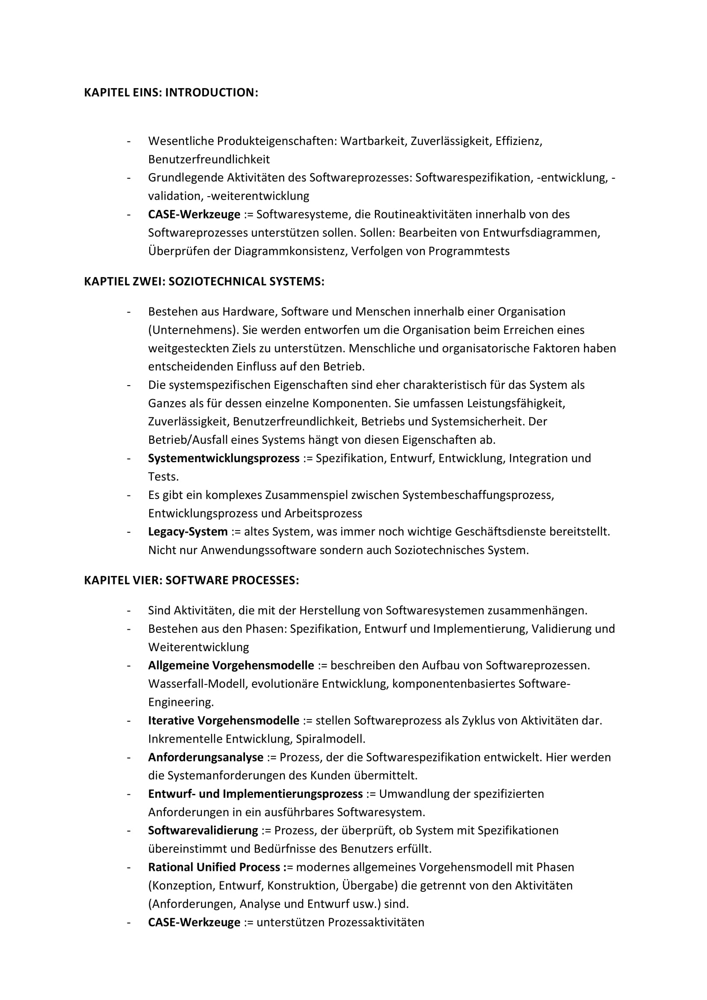
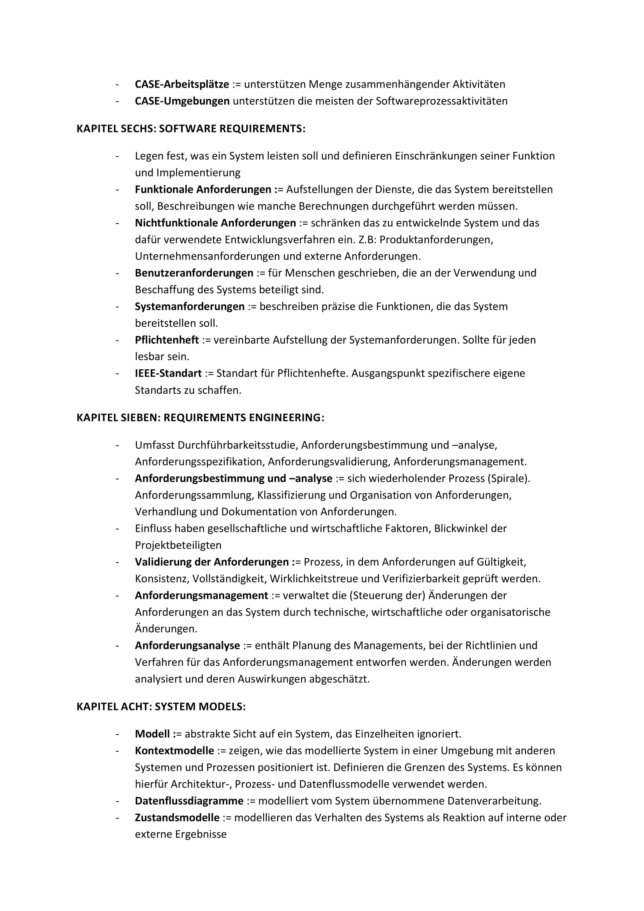
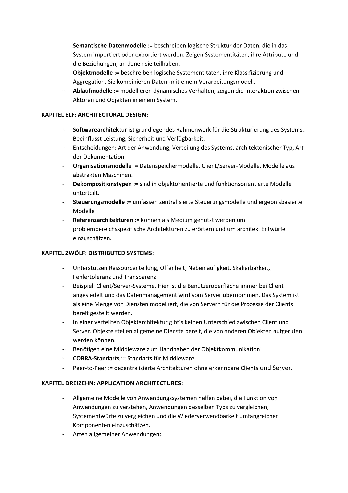
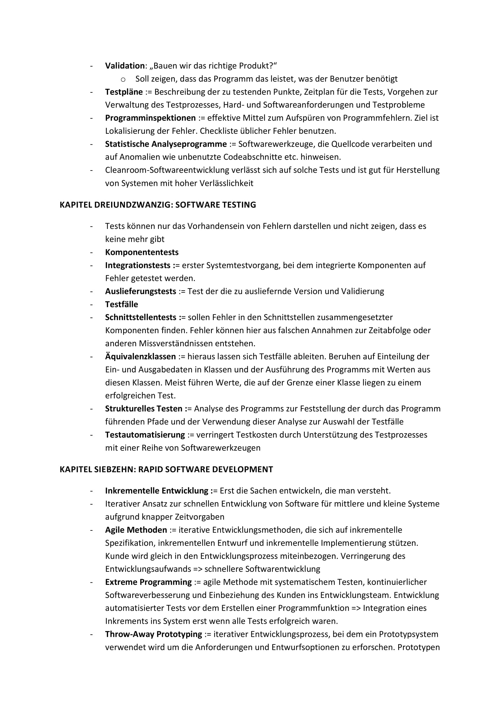
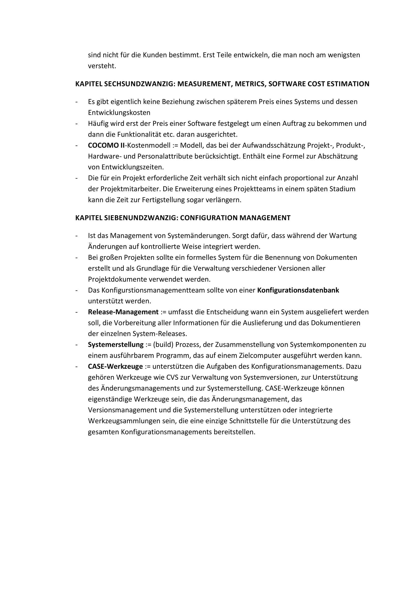

[PDF FILE](https://www.dropbox.com/s/kmcz6l7ky73582c/Zusammenfassung.pdf?dl=0)

#### KAPITEL EINS: INTRODUCTION:

*

#### Wesentliche Produkteigenschaften: Wartbarkeit, Zuverlässigkeit, Effizienz,
Benutzerfreundlichkeit
Grundlegende Aktivitäten des Softwareprozesses: Softwarespezifikation, -entwicklung, validation, -weiterentwicklung
CASE-Werkzeuge := Softwaresysteme, die Routineaktivitäten innerhalb von des
Softwareprozesses unterstützen sollen. Sollen: Bearbeiten von Entwurfsdiagrammen,
Überprüfen der Diagrammkonsistenz, Verfolgen von Programmtests

#### KAPTIEL ZWEI: SOZIOTECHNICAL SYSTEMS:

*
*

#### Bestehen aus Hardware, Software und Menschen innerhalb einer Organisation
(Unternehmens). Sie werden entworfen um die Organisation beim Erreichen eines
weitgesteckten Ziels zu unterstützen. Menschliche und organisatorische Faktoren haben
entscheidenden Einfluss auf den Betrieb.
Die systemspezifischen Eigenschaften sind eher charakteristisch für das System als
Ganzes als für dessen einzelne Komponenten. Sie umfassen Leistungsfähigkeit,
Zuverlässigkeit, Benutzerfreundlichkeit, Betriebs und Systemsicherheit. Der
Betrieb/Ausfall eines Systems hängt von diesen Eigenschaften ab.
Systementwicklungsprozess := Spezifikation, Entwurf, Entwicklung, Integration und
Tests.
Es gibt ein komplexes Zusammenspiel zwischen Systembeschaffungsprozess,
Entwicklungsprozess und Arbeitsprozess
Legacy-System := altes System, was immer noch wichtige Geschäftsdienste bereitstellt.
Nicht nur Anwendungssoftware sondern auch Soziotechnisches System.

#### KAPITEL VIER: SOFTWARE PROCESSES:

*
*

#### Sind Aktivitäten, die mit der Herstellung von Softwaresystemen zusammenhängen.
Bestehen aus den Phasen: Spezifikation, Entwurf und Implementierung, Validierung und
Weiterentwicklung
Allgemeine Vorgehensmodelle := beschreiben den Aufbau von Softwareprozessen.
Wasserfall-Modell, evolutionäre Entwicklung, komponentenbasiertes SoftwareEngineering.
Iterative Vorgehensmodelle := stellen Softwareprozess als Zyklus von Aktivitäten dar.
Inkrementelle Entwicklung, Spiralmodell.
Anforderungsanalyse := Prozess, der die Softwarespezifikation entwickelt. Hier werden
die Systemanforderungen des Kunden übermittelt.
Entwurf- und Implementierungsprozess := Umwandlung der spezifizierten
Anforderungen in ein ausführbares Softwaresystem.
Softwarevalidierung := Prozess, der überprüft, ob System mit Spezifikationen
übereinstimmt und Bedürfnisse des Benutzers erfüllt.
Rational Unified Process := modernes allgemeines Vorgehensmodell mit Phasen
(Konzeption, Entwurf, Konstruktion, Übergabe) die getrennt von den Aktivitäten
(Anforderungen, Analyse und Entwurf usw.) sind.
CASE-Werkzeuge := unterstützen Prozessaktivitäten

#### \-

#### CASE-Arbeitsplätze := unterstützen Menge zusammenhängender Aktivitäten
CASE-Umgebungen unterstützen die meisten der Softwareprozessaktivitäten

#### KAPITEL SECHS: SOFTWARE REQUIREMENTS:

*

#### Legen fest, was ein System leisten soll und definieren Einschränkungen seiner Funktion
und Implementierung
Funktionale Anforderungen := Aufstellungen der Dienste, die das System bereitstellen
soll, Beschreibungen wie manche Berechnungen durchgeführt werden müssen.
Nichtfunktionale Anforderungen := schränken das zu entwickelnde System und das
dafür verwendete Entwicklungsverfahren ein. Z.B: Produktanforderungen,
Unternehmensanforderungen und externe Anforderungen.
Benutzeranforderungen := für Menschen geschrieben, die an der Verwendung und
Beschaffung des Systems beteiligt sind.
Systemanforderungen := beschreiben präzise die Funktionen, die das System
bereitstellen soll.
Pflichtenheft := vereinbarte Aufstellung der Systemanforderungen. Sollte für jeden
lesbar sein.
IEEE-Standart := Standart für Pflichtenhefte. Ausgangspunkt spezifischere eigene
Standarts zu schaffen.

#### KAPITEL SIEBEN: REQUIREMENTS ENGINEERING:

*
*

#### Umfasst Durchführbarkeitsstudie, Anforderungsbestimmung und –analyse,
Anforderungsspezifikation, Anforderungsvalidierung, Anforderungsmanagement.
Anforderungsbestimmung und –analyse := sich wiederholender Prozess (Spirale).
Anforderungssammlung, Klassifizierung und Organisation von Anforderungen,
Verhandlung und Dokumentation von Anforderungen.
Einfluss haben gesellschaftliche und wirtschaftliche Faktoren, Blickwinkel der
Projektbeteiligten
Validierung der Anforderungen := Prozess, in dem Anforderungen auf Gültigkeit,
Konsistenz, Vollständigkeit, Wirklichkeitstreue und Verifizierbarkeit geprüft werden.
Anforderungsmanagement := verwaltet die (Steuerung der) Änderungen der
Anforderungen an das System durch technische, wirtschaftliche oder organisatorische
Änderungen.
Anforderungsanalyse := enthält Planung des Managements, bei der Richtlinien und
Verfahren für das Anforderungsmanagement entworfen werden. Änderungen werden
analysiert und deren Auswirkungen abgeschätzt.

#### KAPITEL ACHT: SYSTEM MODELS:

*

#### Modell := abstrakte Sicht auf ein System, das Einzelheiten ignoriert.
Kontextmodelle := zeigen, wie das modellierte System in einer Umgebung mit anderen
Systemen und Prozessen positioniert ist. Definieren die Grenzen des Systems. Es können
hierfür Architektur-, Prozess- und Datenflussmodelle verwendet werden.
Datenflussdiagramme := modelliert vom System übernommene Datenverarbeitung.
Zustandsmodelle := modellieren das Verhalten des Systems als Reaktion auf interne oder
externe Ergebnisse

#### \-

*

#### Semantische Datenmodelle := beschreiben logische Struktur der Daten, die in das
System importiert oder exportiert werden. Zeigen Systementitäten, ihre Attribute und
die Beziehungen, an denen sie teilhaben.
Objektmodelle := beschreiben logische Systementitäten, ihre Klassifizierung und
Aggregation. Sie kombinieren Daten- mit einem Verarbeitungsmodell.
Ablaufmodelle := modellieren dynamisches Verhalten, zeigen die Interaktion zwischen
Aktoren und Objekten in einem System.

#### KAPITEL ELF: ARCHITECTURAL DESIGN:

#### Softwarearchitektur ist grundlegendes Rahmenwerk für die Strukturierung des Systems.
Beeinflusst Leistung, Sicherheit und Verfügbarkeit.
Entscheidungen: Art der Anwendung, Verteilung des Systems, architektonischer Typ, Art
der Dokumentation
Organisationsmodelle := Datenspeichermodelle, Client/Server-Modelle, Modelle aus
abstrakten Maschinen.
Dekompositionstypen := sind in objektorientierte und funktionsorientierte Modelle
unterteilt.
Steuerungsmodelle := umfassen zentralisierte Steuerungsmodelle und ergebnisbasierte
Modelle
Referenzarchitekturen := können als Medium genutzt werden um
problembereichsspezifische Architekturen zu erörtern und um architek. Entwürfe
einzuschätzen.

#### KAPITEL ZWÖLF: DISTRIBUTED SYSTEMS:

*
*

#### Unterstützen Ressourcenteilung, Offenheit, Nebenläufigkeit, Skalierbarkeit,
Fehlertoleranz und Transparenz
Beispiel: Client/Server-Systeme. Hier ist die Benutzeroberfläche immer bei Client
angesiedelt und das Datenmanagement wird vom Server übernommen. Das System ist
als eine Menge von Diensten modelliert, die von Servern für die Prozesse der Clients
bereit gestellt werden.
In einer verteilten Objektarchitektur gibt’s keinen Unterschied zwischen Client und
Server. Objekte stellen allgemeine Dienste bereit, die von anderen Objekten aufgerufen
werden können.
Benötigen eine Middleware zum Handhaben der Objektkommunikation
COBRA-Standarts := Standarts für Middleware
Peer-to-Peer := dezentralisierte Architekturen ohne erkennbare Clients und Server.

#### KAPITEL DREIZEHN: APPLICATION ARCHITECTURES:

*

#### Allgemeine Modelle von Anwendungssystemen helfen dabei, die Funktion von
Anwendungen zu verstehen, Anwendungen desselben Typs zu vergleichen,
Systementwürfe zu vergleichen und die Wiederverwendbarkeit umfangreicher
Komponenten einzuschätzen.
Arten allgemeiner Anwendungen:

#### o

#### o

#### o
o

#### Datenverarbeitende Systeme: arbeiten im Stapelmodus und haben im
Allgemeinen eine Eingabe-Verarbeitung-Ausgabe Struktur. Datensätze kommen
ins System, werden verarbeitet und Ausgaben erzeugt.
Transaktionsverarbeitende Systeme: sind interaktive Systeme, die den
entfernten Zugriff auf Informationen in einer Datenbank und ihre Veränderung
durch eine Anzahl von Benutzern ermöglichen.
Ergebnisverarbeitende Systeme: Editier- und Echtzeitsysteme. (z.B:
Textverarbeitung)
Sprachverarbeitende Systeme: z.B „Google Translate“

#### KAPITEL VIERZEHN: OBJECT-ORIENTED DESIGN

*
*

#### Methode des Softwareentwurfs, bei dem die grundlegenden Komponenten Objekte, die
einen eigenen Zustand und statt Funktionen Operationen besitzen.
Ein Objekt sollte einen Konstruktor und Prüfoperationen besitzen, die es ermöglichen,
seinen Zustand zu überprüfen und zu ändern. Die Objekte stellen Dienste für andere
Objekte zur Verfügung.
Objekte können sequenziell oder nebenläufig implementiert werden.
UML := Satz von grafischen Notationen um einen objektorientierten Entwurf zu
dokumentieren.
Objektorientierter Entwurf := Aktivitäten zum Entwurf der Systemarchitektur, zur
Bestimmung von Objekten im System, zur Beschreibung des Entwurfs mit Hilfe
verschiedener Objektmodelle, zur Dokumentation der Objektschnittstellen
Objektschnittstellen müssen präzise definiert werden, damit sie von anderen Objekten
verwendet werden können.
Objektorientiertes Design vereinfacht die Weiterentwicklung eines Systems

#### KAPITEL ACHTZEHN: SOFTWARE REUSE

#### Vorteile: niedrige Kosten, schnellere Softwareentwicklung, geringere Risiken,
zuverlässigere Systeme, Spezialisten können effektiver eingesetzt werden etc…
Entwurfsmuster sind allgemein gehaltene Abstraktionen
Programmgeneratoren
Anwedungsrahmen := Mengen von konkreten und abstrakten Objekten, die durch
Spezialisierungen wieder verwendet werden können.
Softwareproduktlinien := verwandte Anwendungen, die aus einer oder mehreren
Basisanwendungen entwickelt werden.

#### KAPITEL NEUNZEHN: COMPONENT-BASED SE

#### Implementierung lose gekoppelter, unabhängiger Komponenten zu Systemen
Jede Komponente = Eine Softwareeinheit. Funktionen und Abhängigkeiten sind
vollständig von einer Reihe öffentlicher Schnittstellen bestimmt.
Zusammenstellungsarten := sequenziell, hierarchisch, hinzufügende Komposition

#### KAPITEL ZWEIUNDZWANZIG: VERIFICATION AND VALIDATION

#### Verifikation: „Bauen wir das Produkt richtig?“
o Soll zeigen, dass ein Programm seiner Spezifikation entspricht

#### \-

#### Validation: „Bauen wir das richtige Produkt?“
o Soll zeigen, dass das Programm das leistet, was der Benutzer benötigt
Testpläne := Beschreibung der zu testenden Punkte, Zeitplan für die Tests, Vorgehen zur
Verwaltung des Testprozesses, Hard- und Softwareanforderungen und Testprobleme
Programminspektionen := effektive Mittel zum Aufspüren von Programmfehlern. Ziel ist
Lokalisierung der Fehler. Checkliste üblicher Fehler benutzen.
Statistische Analyseprogramme := Softwarewerkzeuge, die Quellcode verarbeiten und
auf Anomalien wie unbenutzte Codeabschnitte etc. hinweisen.
Cleanroom-Softwareentwicklung verlässt sich auf solche Tests und ist gut für Herstellung
von Systemen mit hoher Verlässlichkeit

#### KAPITEL DREIUNDZWANZIG: SOFTWARE TESTING

*
*

#### Tests können nur das Vorhandensein von Fehlern darstellen und nicht zeigen, dass es
keine mehr gibt
Komponententests
Integrationstests := erster Systemtestvorgang, bei dem integrierte Komponenten auf
Fehler getestet werden.
Auslieferungstests := Test der die zu ausliefernde Version und Validierung
Testfälle
Schnittstellentests := sollen Fehler in den Schnittstellen zusammengesetzter
Komponenten finden. Fehler können hier aus falschen Annahmen zur Zeitabfolge oder
anderen Missverständnissen entstehen.
Äquivalenzklassen := hieraus lassen sich Testfälle ableiten. Beruhen auf Einteilung der
Ein- und Ausgabedaten in Klassen und der Ausführung des Programms mit Werten aus
diesen Klassen. Meist führen Werte, die auf der Grenze einer Klasse liegen zu einem
erfolgreichen Test.
Strukturelles Testen := Analyse des Programms zur Feststellung der durch das Programm
führenden Pfade und der Verwendung dieser Analyse zur Auswahl der Testfälle
Testautomatisierung := verringert Testkosten durch Unterstützung des Testprozesses
mit einer Reihe von Softwarewerkzeugen

#### KAPITEL SIEBZEHN: RAPID SOFTWARE DEVELOPMENT

*
*

#### Inkrementelle Entwicklung := Erst die Sachen entwickeln, die man versteht.
Iterativer Ansatz zur schnellen Entwicklung von Software für mittlere und kleine Systeme
aufgrund knapper Zeitvorgaben
Agile Methoden := iterative Entwicklungsmethoden, die sich auf inkrementelle
Spezifikation, inkrementellen Entwurf und inkrementelle Implementierung stützen.
Kunde wird gleich in den Entwicklungsprozess miteinbezogen. Verringerung des
Entwicklungsaufwands => schnellere Softwarentwicklung
Extreme Programming := agile Methode mit systematischem Testen, kontinuierlicher
Softwareverbesserung und Einbeziehung des Kunden ins Entwicklungsteam. Entwicklung
automatisierter Tests vor dem Erstellen einer Programmfunktion => Integration eines
Inkrements ins System erst wenn alle Tests erfolgreich waren.
Throw-Away Prototyping := iterativer Entwicklungsprozess, bei dem ein Prototypsystem
verwendet wird um die Anforderungen und Entwurfsoptionen zu erforschen. Prototypen

#### sind nicht für die Kunden bestimmt. Erst Teile entwickeln, die man noch am wenigsten
versteht.
KAPITEL SECHSUNDZWANZIG: MEASUREMENT, METRICS, SOFTWARE COST ESTIMATION

*
*

#### Es gibt eigentlich keine Beziehung zwischen späterem Preis eines Systems und dessen
Entwicklungskosten
Häufig wird erst der Preis einer Software festgelegt um einen Auftrag zu bekommen und
dann die Funktionalität etc. daran ausgerichtet.
COCOMO II-Kostenmodell := Modell, das bei der Aufwandsschätzung Projekt-, Produkt-,
Hardware- und Personalattribute berücksichtigt. Enthält eine Formel zur Abschätzung
von Entwicklungszeiten.
Die für ein Projekt erforderliche Zeit verhält sich nicht einfach proportional zur Anzahl
der Projektmitarbeiter. Die Erweiterung eines Projektteams in einem späten Stadium
kann die Zeit zur Fertigstellung sogar verlängern.

#### KAPITEL SIEBENUNDZWANZIG: CONFIGURATION MANAGEMENT

*
*

#### Ist das Management von Systemänderungen. Sorgt dafür, dass während der Wartung
Änderungen auf kontrollierte Weise integriert werden.
Bei großen Projekten sollte ein formelles System für die Benennung von Dokumenten
erstellt und als Grundlage für die Verwaltung verschiedener Versionen aller
Projektdokumente verwendet werden.
Das Konfigurstionsmanagementteam sollte von einer Konfigurationsdatenbank
unterstützt werden.
Release-Management := umfasst die Entscheidung wann ein System ausgeliefert werden
soll, die Vorbereitung aller Informationen für die Auslieferung und das Dokumentieren
der einzelnen System-Releases.
Systemerstellung := (build) Prozess, der Zusammenstellung von Systemkomponenten zu
einem ausführbarem Programm, das auf einem Zielcomputer ausgeführt werden kann.
CASE-Werkzeuge := unterstützen die Aufgaben des Konfigurationsmanagements. Dazu
gehören Werkzeuge wie CVS zur Verwaltung von Systemversionen, zur Unterstützung
des Änderungsmanagements und zur Systemerstellung. CASE-Werkzeuge können
eigenständige Werkzeuge sein, die das Änderungsmanagement, das
Versionsmanagement und die Systemerstellung unterstützen oder integrierte
Werkzeugsammlungen sein, die eine einzige Schnittstelle für die Unterstützung des
gesamten Konfigurationsmanagements bereitstellen.